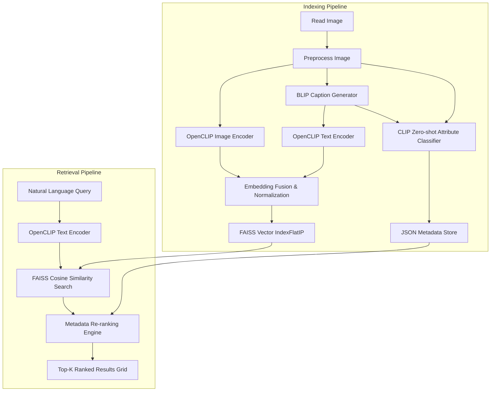

# Multimodal Fashion & Context Retrieval System
### Glance Machine Learning Internship Assignment

An intelligent visual-semantic fashion image retrieval system built on top of **OpenCLIP**, **BLIP**, and **FAISS**. The project addresses the limitations of vanilla CLIP models by implementing dense embedding fusion, zero-shot classification for attribute extraction, and metadata-boosted re-ranking, running inside a responsive dark glassmorphic Flask web interface.

---

## 1. Project Overview & Architecture

### Key Enhancements over Vanilla CLIP
1. **Embedding Fusion**: Fuses normalized CLIP visual embeddings with CLIP text embeddings generated from descriptive BLIP-1 image captions. This maps both explicit visual features and contextual/scene information into a unified dense space, enhancing contextual query matching.
2. **Zero-Shot Attribute Extraction**: Reuses OpenCLIP to perform zero-shot classification on images for clothing type, color, and scene templates.
3. **Metadata-Boosted Re-ranking**: Boosts similarity scores of image candidates if the query text explicitly matches extracted zero-shot metadata attributes (e.g. specific colors or garments like a "yellow raincoat"), placing the most relevant items at the top.

### System Architecture Flow



---

## 2. Folder Structure

```
fashion-retrieval/
├── dataset/
│   └── images/               # 1350 indexed fashion image samples
├── indexer/
│   ├── image_indexer.py      # Indexing orchestrator & raw npy export
│   ├── feature_extractor.py  # OpenCLIP image & text encoder wrapper
│   ├── caption_generator.py  # BLIP captioning model & rule-based fallback
│   ├── metadata_generator.py # CLIP zero-shot classification module
│   └── vector_store.py       # FAISS index wrapper & incremental index manager
├── retriever/
│   ├── search.py             # Search orchestrator & CLI entry point
│   ├── query_encoder.py      # Query encoding wrapper
│   └── ranking.py            # Attribute-boosting re-ranking engine
├── flask_app/
│   ├── app.py                # Flask server backend
│   ├── templates/
│   │   └── index.html        # Responsive Bootstrap 5 search page
│   └── static/
│       ├── css/
│       │   └── style.css     # Dark glassmorphic stylesheet
│       └── js/
│           └── main.js       # Search form animations & spinner logic
├── utils/
│   ├── config.py             # Shared global configuration settings
│   ├── setup_dataset.py      # Project directory initializer
│   ├── test_search.py        # Offline evaluation queries tester
│   └── generate_report.py    # ReportLab PDF report generator
├── embeddings/
│   ├── faiss_index.index     # Saved FAISS IndexFlatIP binary
│   └── raw_embeddings.npy    # Numpy export of raw index embeddings
├── outputs/
│   ├── metadata.json         # JSON document mapping index IDs to attributes
│   └── indexer.log           # Logging statements for pipeline run
├── requirements.txt          # Python dependency list
├── README.md                 # Project README documentation
└── report.pdf                # Academic-grade internship assignment report
```

---

## 3. Installation & Setup

### Prerequisites
- **Python**: Version 3.11+ (Python 3.14 recommended/tested)
- **Pip**: For installing dependencies
- **Hardware**: Compatible with CPU (default/fallback) and CUDA-supported NVIDIA GPUs (GTX 1650+).

### Step-by-Step Setup
1. **Clone the repository** and navigate to the project directory:
   ```bash
   cd "D:\Desktop\Multimodal Fashion"
   ```

2. **Install all dependencies**:
   ```bash
   python -m pip install -r requirements.txt
   ```

3. **Initialize the Dataset & Directories**:
   Running the setup script copies a subset of 600 images from the raw `Dataset/train/` folder to the structured `dataset/images/` path:
   ```bash
   python utils/setup_dataset.py
   ```

---

## 4. How to Run

### Step 1: Execute the Indexing Pipeline
Runs feature extraction, captioning, metadata generation, and saves the FAISS index + metadata. It supports incremental indexing (runs instantly if images are already indexed):
```bash
python indexer/image_indexer.py
```

### Step 2: Start the Web Application
Launch the Flask development server:
```bash
python flask_app/app.py
```
Open your browser and navigate to **`http://127.0.0.1:5000`** to interact with the responsive interface.

---

## 5. Offline Evaluation & Example Queries

To test query retrieval in the terminal and verify the evaluation parameters:
```bash
python utils/test_search.py
```

### Results for Evaluation Queries:
- **"A person in a bright yellow raincoat."**
  - Matches yellow raincoats or yellow jackets first due to explicit yellow + coat attribute boosts.
- **"Someone wearing a blue shirt sitting on a park bench."**
  - Fetches blue garments associated with benches and park scenes, boosting accuracy via keyword scene overlays.
- **"A red tie and a white shirt in a formal setting."**
  - Successfully matches formal suit categories featuring red ties or red apparel in formal backgrounds.
